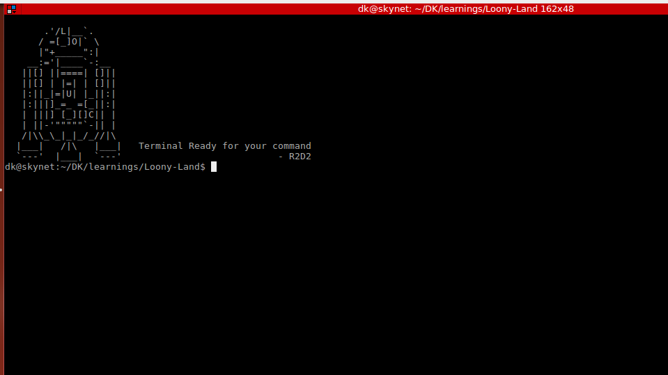

# **Add ASCII art to terminal:**

 - Save the `r2d2` file to a preferred location, I used `/etc/r2d2`
 - In your `.bashrc` file add `cat /etc/r2d2`

Whenever you open your terminal you will see ASCII art in your terminal, change it to whatever you want.

